## Rendering demos

This project is a real-time graphics showcase built in C++/OpenGL. It demonstrates multiple techniques including:

- Phong and Blinn-Phong shading models
- Directional, point, and spot light shadows
- Particle systems
- Instancing with 10K objects
- Procedural texturing
- Post-processing effects: gamma correction, inverse, grayscale, Gaussian blur

---

### Phong / Blinn-Phong Shading Models Comparison

#### Point Light
| Blinn-Phong | Phong |
|-------------|-------|
| <div align="center">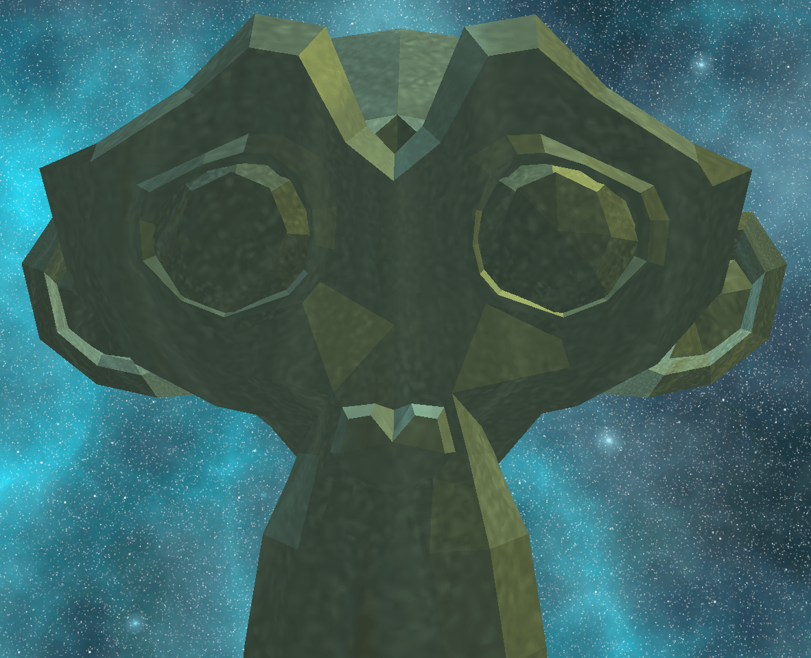</div> | <div align="center">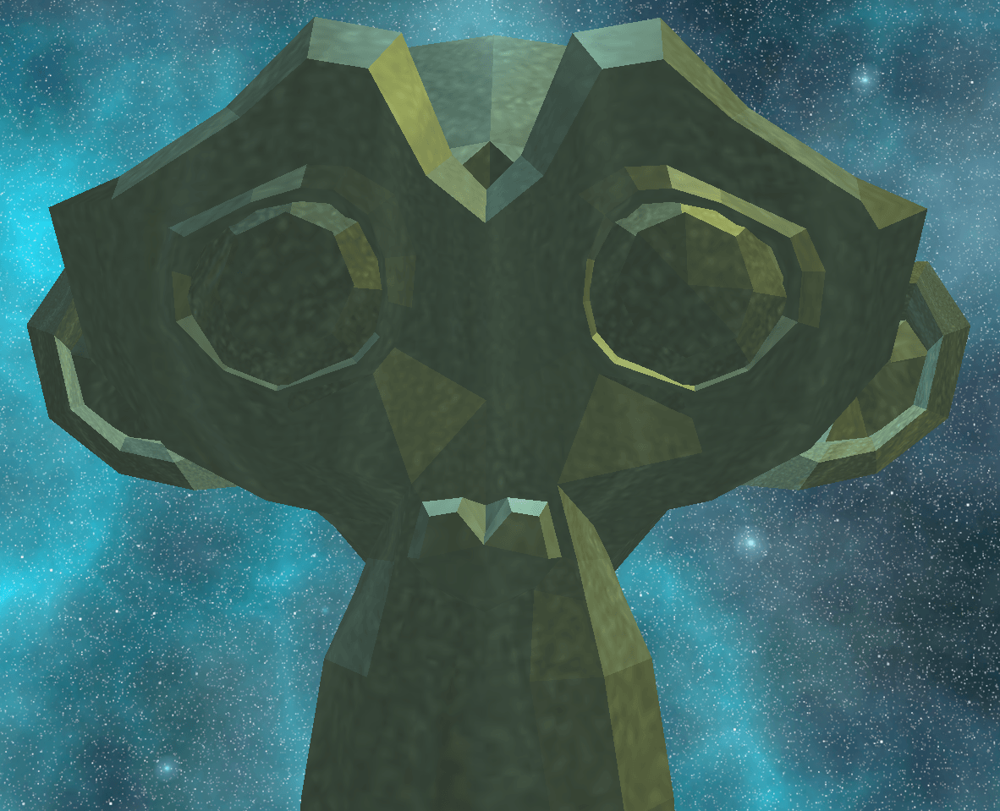</div> |

---

#### Spot Light
| Blinn-Phong | Phong |
|-------------|-------|
| <div align="center"></div> | <div align="center">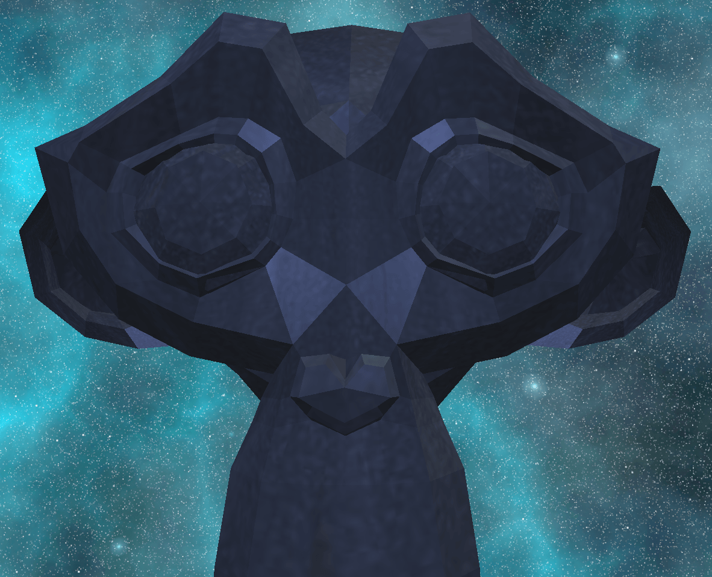</div> |

---

#### Directional Light
| Blinn-Phong | Phong |
|-------------|-------|
| <div align="center">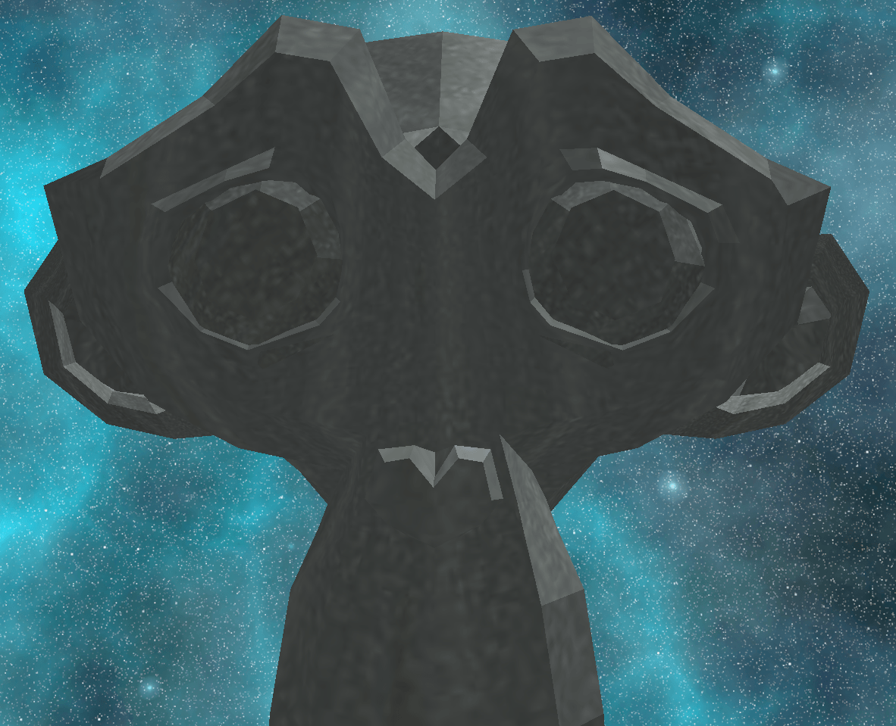</div> | <div align="center">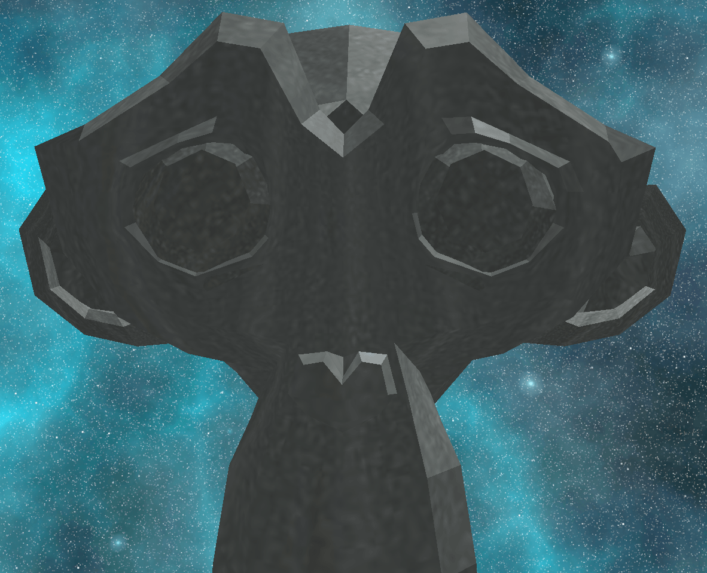</div> |

---

#### Instancing Demo
*10K instances ~45fps*
<div align="left"></div>


---

#### Particle Demo
<div align="left"></div>

---

#### Procedural Texturing Demo
*in shaders*

| Cube | Sphere | Torus |
|------|--------|-------|
| <div align="center"></div> | <div align="center"></div> | <div align="center"></div> |

---

#### Directional Shadow Mapping
*Extended to point and spot lights using a perspective matrix*

| Point Light | Spot Light | Directional Light |
|------------|------------|-------------------|
| <div align="center">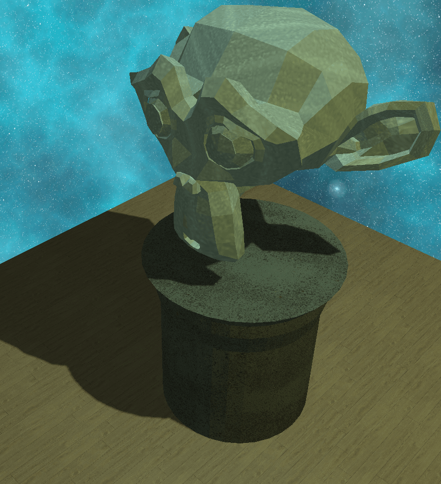</div>  | <div align="center">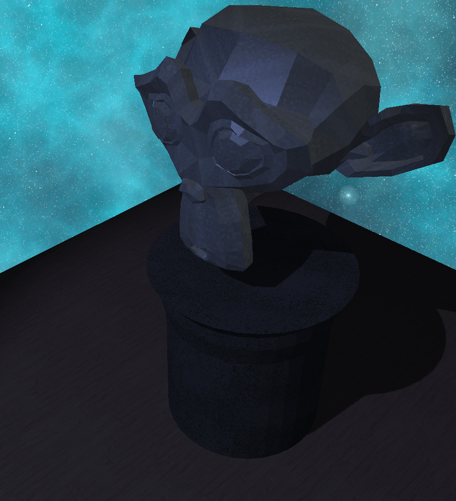</div>  | <div align="center">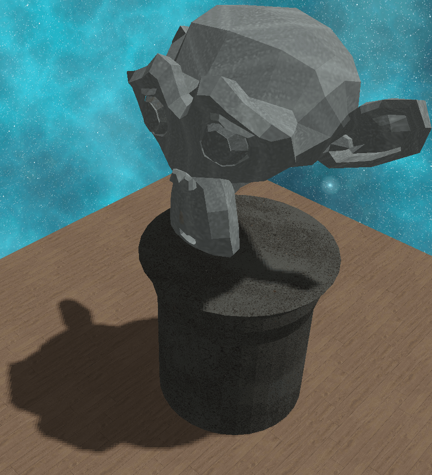</div> |

> **Note:**  
> Since point and spot lights use a perspective matrix instead of orthographic, you need to adjust bias parameters to avoid shadow acne.

**Parameters used:**
- **Point light:** max = 0.003, min = 0.0001  
- **Spot light:** max = 0.001, min = 0.0001  
- **Directional light:** max = 0.05, min = 0.0001 

---

#### Post-Processing
| Gamma correction | Without gamma correction | Inverse | Grayscale | Gaussian blur |
|------------|------------|-------------------|-------------------|-------------------|
| <div align="center">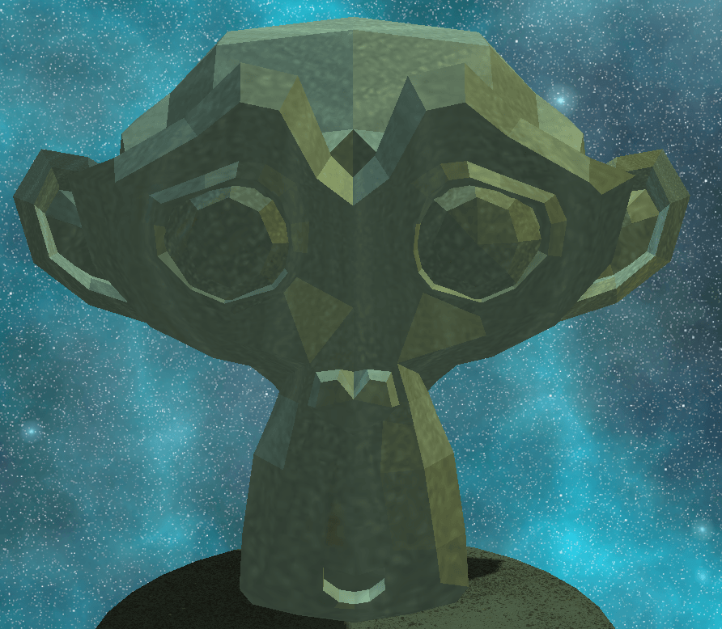</div>  | <div align="center">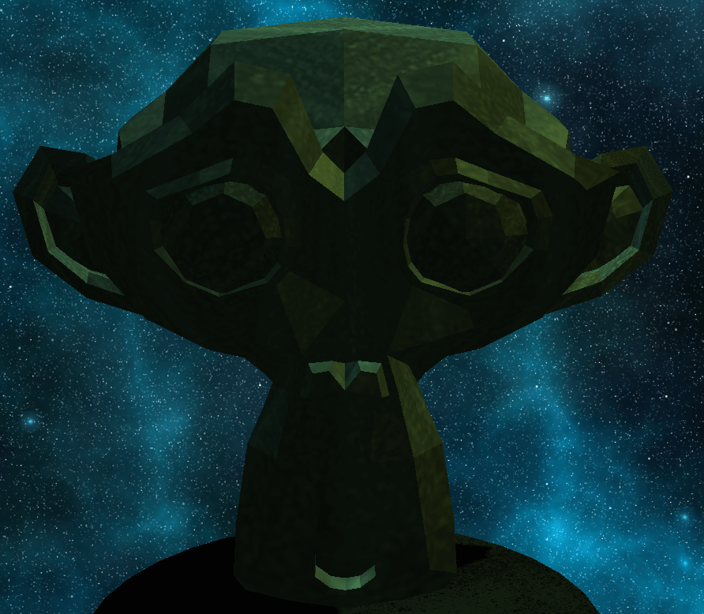</div>  | <div align="center">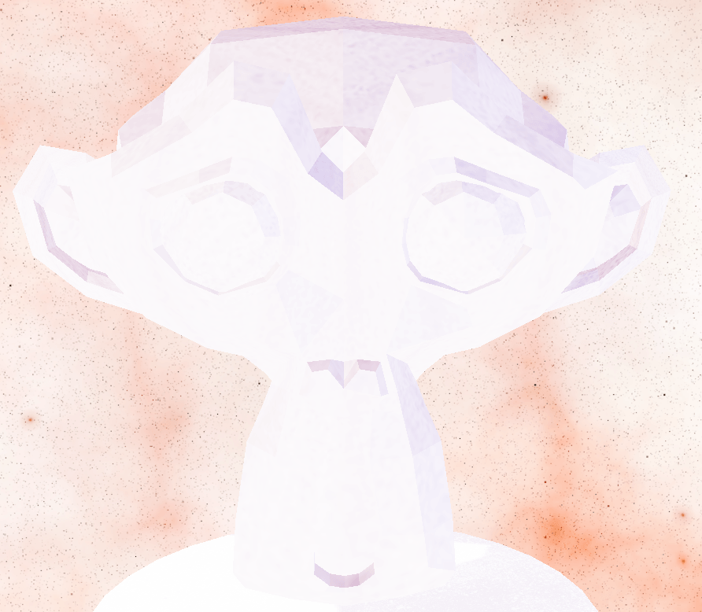</div> | <div align="center">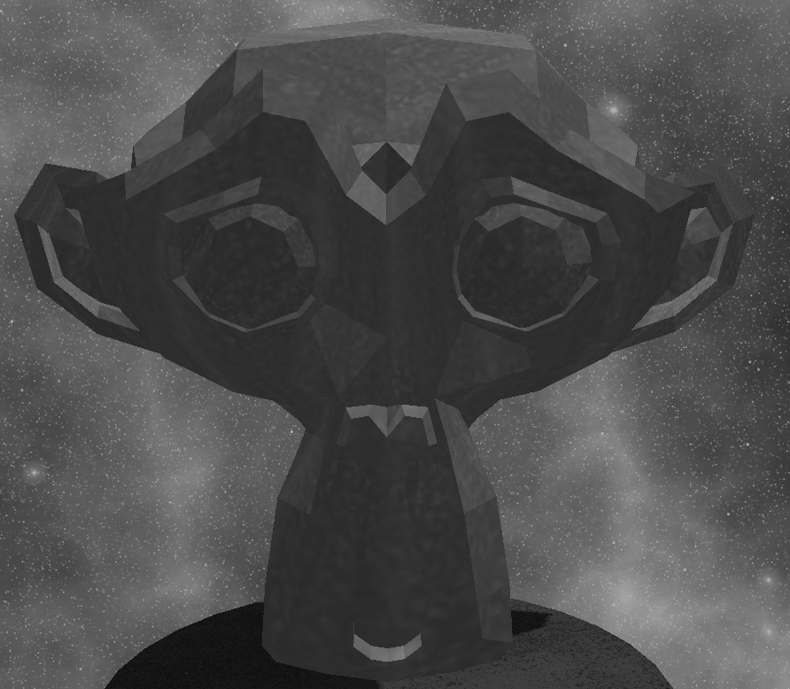</div> | <div align="center">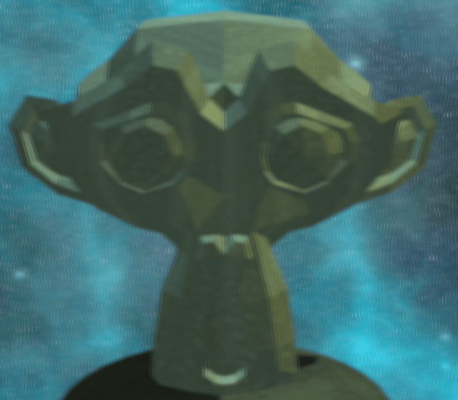</div> |

---
### Dependencies:


### Build:
```cmake --build build```

### Run:
```./build/museum```

---

### Features Planned
The project roadmap includes implementing additional graphics techniques such as:
- **MSAA (Multi-sample anti-aliasing)**
- **Omnidirectional shadow mapping**
- **Normal mapping**
- **HDR (High dynamic range)**
- **SSAO (Screen-space ambient occlusion)**

---

This project is in the public domain. See [UNLICENSE.txt](UNLICENSE.txt)

---
